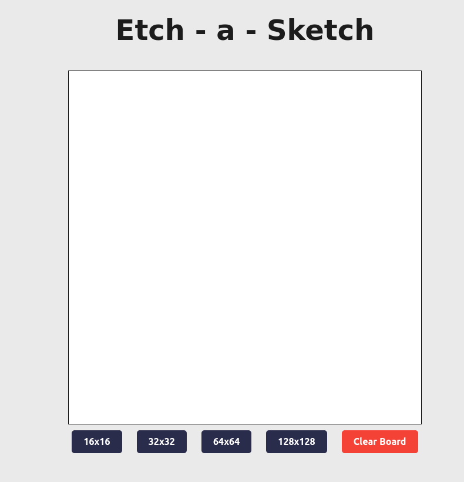

# Etch-a-Sketch

 This is another JavaScript project of mine. The aim was to explore event listeners and how I could use them to make changes to the DOM. So I decided to do my own implementation of another well-known, classic game: Etch-A-Sketch.

 You can try it <a href="https://amarques02.github.io/etch-a-sketch/">here</a>.

 Here is what it looks like: 

<h2> 💻 Technologies:</h2>
<ul>
	<li>JavaScript</li>
	<li>Html</li>
	<li>CSS</li>
</ul>
